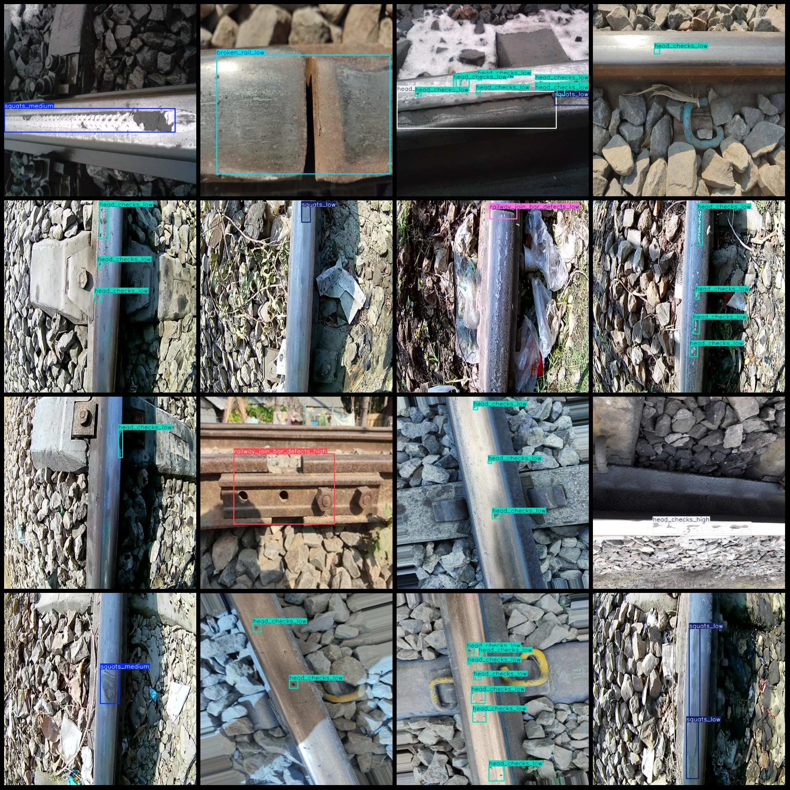
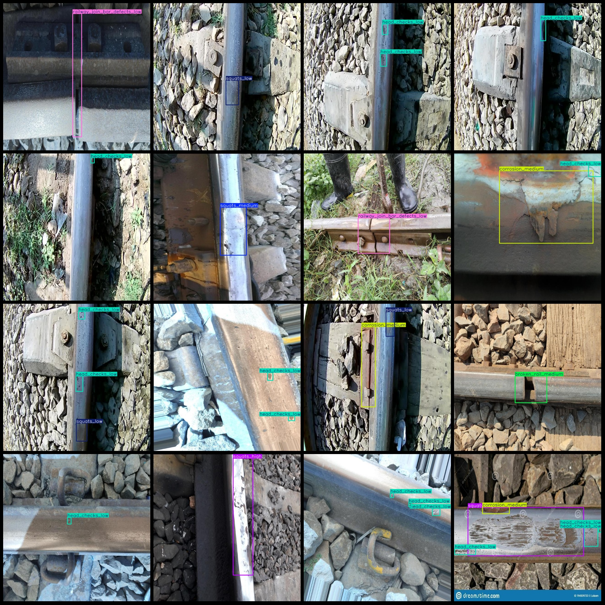

# Intelligent Railway Patrol and Inspection Data Set for Track Corrosion, Breakage, Impermeability Defects: VOC+YOLO Format with 2324 Images in 15 Categories

The dataset format is Pascal VOC format + YOLO format (the txt file does not contain the split path, it only contains the jpg images and corresponding VOC format xml files and yolo format txt files).
number of images: 2324  
annotation count: 2324  
annotation count: 2324  
The number of categories is 15.
```
[ "broken_rail_high", "broken_rail_low", "broken_rail_medium", "corrosion_high", "corrosion_low", "corrosion_medium", "head_checks_high", "head_checks_low", "head_checks_medium", "railway_join_bar_defects_high", "railway_join_bar_defects_low", "railway_join_bar_defects_medium", "squats_high", "squats_low", "squats_medium"]
```
boxes per class:   
Broken rail high (steel rail fracture - heavy) box count = 135
Broken rail low (Steel Rail Damage - Mild) box count = 84
Broken Rail Medium (Steel Rail Fracture - Moderate) Box Count = 48  
"Corrosion High (Corrosion - Severe)" refers to a condition where corrosion occurs at a severe level. The number of frames for this condition is "25."
The number of frames with corrosion-low (corrosion - mild) is 15.
Corrosion medium (medium corrosion) frame count = 18.
Head checks high (Railhead crack - Severe) box count = 180  
Head checks low (Railhead crack - Mild) box count = 3724
Head Checks Medium (Railhead Crack - Moderate) Frame Count = 222
High (railway_join_bar_defects) box count = 67  
Low (railway_join_bar_defects) box count = 171  
Medium (railway_join_bar_defects) box count = 59  
High (squats) box count = 67  
Low (squats) box count = 565
squats_medium (rail indentation - medium) frame count = 112
total boxes: 5492  
image resolution: 640x640  
Application Domain: These are common categories of railway track defect detection, and subdivided by severity (mild, moderate, severe).
Use labelImg
Annotation rule: Draw a rectangle around the class.
Important Notice: None
Special Disclaimer: This dataset does not guarantee the accuracy of the trained model or weight files.
Preview of the image:
## Images





Here is a pay link on Stripe ( https://buy.stripe.com/3cs8yP7sY87d0vu9AB ). Please contact me lonlonago@foxmail.com after funding $89, and I will send you a complete data files , thank you!

